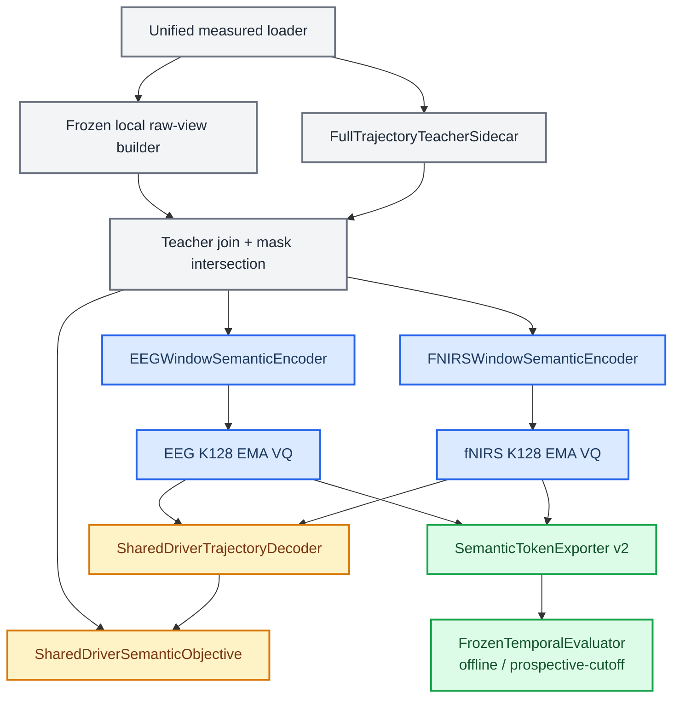

# Shared-Driver Semantic VQ 代码迁移计划

_设计迁移，不授权立即删除 E2 runtime；执行门禁见 [04](04_IMPLEMENTATION_VALIDATION_PLAN.md)_

---

## 📋 迁移边界

本次迁移尽量复用已验证的软件资产，但不通过修改旧类的默认语义来伪装兼容。推荐新增明确的 architecture generation，并保留 E2 checkpoint 的可重放路径。

### 复用

- `UnifiedPhysiologyWindowDataset` 的 measured-data window、sample identity、geometry 和 boundary mask；
- 当前 corrected EMA VQ、fixed `K=128, D=64`、health logging 和 export 基础；
- adaptive SSM 推断核心与 E0 provenance；
- split/protected registry、run manifest 和 frozen-evaluation基础设施。

### 新增或替换

- full-trajectory teacher-v2 schema/builder；
- sidecar 与 raw-view selection 解耦；
- modality-only full-window temporal encoder；
- shared driver trajectory decoder；
- 单一 semantic objective；
- decoded-prototype signature export/matching；
- teacher-independent evaluators：双向 token 的离线时延条件关联，以及满足严格 cutoff 的窗外 raw-fNIRS 预测。

### 退出新主线

- E2 的 `r_mean/r_slope` 与 HbO/HbR routed target heads；
- local/prototype/context/coupling 多入口 loss；
- post-VQ causal context 作为 token identity 的唯一上下文；
- semantic + residual 联合 raw reconstruction 默认路径；
- discrete effect/nuisance token；
- coupling shaper、InfoNCE、same-index 与 foundation model 必需阶段。

## 🧭 建议模块边界



## 📦 配置 namespace

建议新增而不是覆盖：

```text
experiments/configs/physiology_semantic_tokenizer/
├── r0_contract_freeze.yaml
├── r1_full_trajectory_teacher.yaml
├── r2_continuous_observability.yaml
├── r3_shared_driver_vq.yaml
├── r4_private_ablation.yaml
├── r5_prototype_semantics.yaml
├── r6a_offline_association.yaml
├── r6b_prospective_cutoff.yaml
└── r7_protected_confirmation.yaml
```

每个 config 必须声明：

```yaml
architecture_generation: shared_driver_semantic_vq_v1
codebook_size: 128
codebook_dim: 64
semantic_target: adaptive_joint_full_trajectory
tokenizer_inputs: measured_modality_and_boundary_finite_mask_only
token_temporal_scope: bidirectional_full_window
evaluator_temporal_mode: offline_same_window
artifact_mask_policy: annotation_only
protected_open: false
protected_fit_policy: apply_only
```

`token_temporal_scope` 只允许 `bidirectional_full_window | causal_past`，描述 tokenizer 本身；`evaluator_temporal_mode` 只允许 `offline_same_window | completed_window_cutoff | semantic_only`。completed-window wrapper 属于 evaluator，不能把 bidirectional token 伪装成 causal token。

## 📥 数据迁移

迁移顺序：

1. 为现有 registered sample IDs 生成 target coverage table；
2. 实现 `[10,20]` full trajectory 与 `[10,20]` pointwise-valid sidecar；
3. 将 raw view builder 移到 teacher join 之前；
4. 证明有无 sidecar 时 raw tensor/hash 完全一致；
5. 构造逐点 `valid[:, :, None] ∩ teacher[:, :, None] ∩ target_point_valid` mask；
6. 对 current policy 与 historical E2 policy 分别记录 manifest；
7. 完成 R1-D subject-specific leave-one-trial 与 R1-P population-frozen 两种 provenance；R1-P 的参数、anchor、EEG projection 与 normalization 均不得在 held-out subject 重拟合。
8. 由同一 R1-P bundle 成对生成 \(r^J/r^E\)，仅移除 fNIRS update，并用两者 pointwise support 交集定义 \(\delta^F\)；
9. R1-P 重新通过 population-frozen physical reconstruction、jointness、gauge stability、observability 与非退化 correction panel，不能继承旧 E0 PASS。

旧 sidecar reader 保留在明确的 `e2_legacy` 入口，不允许自动升级旧 cache。

## 🧠 模型迁移

新模型应与旧 `PhysiologySemanticTokenizer` 分开注册，直到 R3-P 通过。建议 public forward：

```python
forward(
    eeg_raw,
    fnirs_raw,
    valid_mask,
    *,
    return_posteriors=False,
    return_private=False,
)
```

teacher target 不属于 model forward；它只进入 objective。metadata 也不进入 encoder。

两个 full-window encoder 的层数、宽度和 dropout 应在 R2 前冻结，只允许 train-only 工程校准。输出为 `[B,10,64]`。量化器独立，decoder 共享并输出 `[B,10,20]`。

所有 quantizer calibration 也必须在第一次查看 subjects `19–23` 的 R3-P 结果前冻结；launcher 不提供 validation failure 后的 promotion retry。

## ⚙️ 损失迁移

新增独立 objective：

```text
driver_trajectory_loss
+ commitment_loss
+ codebook_health_terms
```

删除 semantic objective 中的：

```text
raw reconstruction
state mean/slope
prototype head
context head
coupling preservation
same-ID / pair alignment
```

若 R4 启用 private branch，raw reconstruction 使用单独 module/optimizer 或严格 stop-gradient。必须用参数级 gradient allowlist 测试，不只检查 loss 名称。

## 📤 导出和 evaluator 迁移

export schema v2 新增：

- full decoded driver signature；
- continuous pre-VQ latent；
- `token_temporal_scope`、逐 token receptive-field absolute start/end、`record_id` 与 input absolute interval；
- teacher family/scope/hash；
- raw-view、mask-policy 和 coverage hash。

evaluator 不 import training loss 或 teacher adapter。它只读取 frozen export、raw fNIRS endpoint 和注册 controls。q0/q1 必须分别初始化和训练，容量匹配，并写出每个 subject/lag/null 的 proper score。

- `offline_same_window` 模式允许 `bidirectional_full_window` token，但输出 schema 强制使用 offline/association 标签。
- `completed_window_cutoff` 首版只接受已通过 R2-P/R3-P/R5 的同一双向 tokenizer，并只汇总已结束窗口；按 `(record_id, absolute_start, absolute_end)` 断言 `token_RF_end + embargo < endpoint_start`。receptive field 必须包含预处理/滤波支持，不能用 row ID 代替实际区间。
- 新 `causal_past` tokenizer 必须重新通过自己的 R2-P/R3-P/R5。
- primary development protocol 固定在 subjects `01–18` fit q0/q1、对 `19–23` apply，并标记为 post-selection development evidence。若运行 nested sensitivity，R1-P teacher、tokenizer、checkpoint 和 evaluator 必须逐 outer fold 全部重建。只有一次性 protected R7 是独立 confirmation。

R7 不复用 R6 checkpoint bundle。设计冻结后必须按顺序在 `01–23` 生成 R1-P-final、最终 tokenizer、最终 export、common probe/phase baseline，以及适用时的 q0/q1；全部 hash 冻结后 `24–29` 只能 apply。protected 首先运行冻结阈值的 apply-only teacher panel，任何组件不得在 protected 上 refit 或 early-stop。

## 🧪 必需测试

- full trajectory 的精确时间切片；
- teacher join 不改变 raw view；
- encoder input allowlist；
- modality perturbation independence；
- full-window receptive field 与 mask；
- fixed K128/D64；
- shared decoder input/shape；
- semantic loss 的梯度隔离；
- private stop-gradient；
- ID permutation 不改变 signature-level 结果；
- export/checkpoint round trip；
- lag indexing、双 temporal enum、absolute-time receptive-field cutoff、embargo 与 impossible-lag null；
- protected access rejection；
- canonical/runtime SVG 与 plan SVG deterministic drift。

## 🔄 迁移提交建议

为了保持可审计性，按下列最小提交单元实施：

1. teacher-v2 schema、builder、tests；
2. raw-view/sidecar/mask 解耦；
3. continuous students 与 R2 runner；
4. shared-driver VQ model/objective；
5. export/signature tooling；
6. optional private branch；
7. R3-P/R5 合取门 runner 与 fail-closed promotion；
8. R6A offline evaluator/null suite；
9. R6B completed-window cutoff evaluator 与绝对时间泄漏测试；
10. canonical architecture promotion（仅在门禁后）。

每个提交只改变一个可命名责任，并附 before/after contract。不得在同一提交同时更改 target、mask、split 和 evaluator。

## ✅ 删除时机

旧 runtime、configs、sidecars 和 tests 在以下条件全部满足前不删除：

- E2 可从固定 commit/manifest 重放；
- R3-P development gate 已完成；
-新 launcher/export consumer 全部切换；
- architecture changelog 记录 supersession；
- history documentation 链接不再依赖可执行旧路径。
