# Comparative-method experiment workflow

_Four-dataset downstream benchmark contract and readiness audit, frozen 2026-07-17_

---

## 📋 Decision and current readiness

The comparison program is approved to enter **preparation**, but it is not ready for formal training. The measured-data entrance and DSR exclusion guard are now available through `UnifiedPhysiologyWindowDataset`; the downstream target contract, shared split manifests, method adapters, and reproduction checks are not yet complete.

This document fixes the workflow while leaving the final comparison-method set open. STA-Net and EFRM are admitted only as **candidates for integration audit**. The labels “traditional-model SOTA” and “foundation-model SOTA” remain literature-positioning hypotheses until the method review records the exact paper scope, evaluation regime, code revision, license, and relevance to each task. They are not project conclusions.

### Audit verdict

| Area | Checkout evidence | Verdict | Required action |
| --- | --- | --- | --- |
| Four measured datasets | Unified loader registers Single-Trial, REFED, Visual, and Simultaneous | Ready for adapter work | Freeze cache and contract hashes |
| Three discrete / one continuous families | Dataset descriptions support this division | Partially ready | Promote REFED continuous targets into a versioned label adapter |
| DSR removal | Unified loader hard-excludes `simultaneous_eeg_nirs:dsr`; current contract reports 467 source windows excluded and 0 exposed | Ready | Preserve the invariant in every downstream adapter/preflight |
| Visual timing | Documented DC9 appearance→3-second disappearance semantics replace every-third-row parsing | Ready; 54/55 records | Keep S06 Part1 excluded unless stronger raw evidence appears |
| Subject-independent comparison | Subjects are present in the unified sample contract | Not implemented | Generate one shared split manifest per dataset/task |
| STA-Net | Official code is present locally at revision `b6db8bb5eb2f6491a13f0938880ee70e32162ee7`; model and runner are fixed to paired, binary classification and method-specific tensors | Candidate only | Reproduce source behavior, then add unified-loader adapter and configurable head |
| EFRM | Official code is present locally at revision `a62bf3d4c092ac3022b6c0bad90ec3993d5a5720`; released downstream path uses classification heads and `CrossEntropyLoss` | Candidate only | Separate pretraining regimes and add a regression-capable evaluation head |
| Method provenance | Both local candidates are ignored nested Git repositories rather than tracked project dependencies | Blocking for formal runs | Pin source URL, revision, patch, environment, and license status in a method manifest |
| Fair result table | No common tasks, splits, data regimes, metrics, or seed policy are frozen | Not ready | Complete C0–C4 before any formal result |

The pre-contract read-only audit yielded 9,921 window references, including DSR and only eight Visual subjects. It is retained below as historical evidence of the gaps that prompted this change:

| Dataset/task | Windows | Subjects | Audit implication |
| --- | ---: | ---: | --- |
| Single-Trial / motor imagery | 1,740 | 29 | Discrete track available |
| Single-Trial / mental arithmetic | 1,740 | 29 | Discrete track available |
| REFED / emotion video | 480 | 32 | Continuous stream adapter missing |
| Visual / cognitive motivation | 3,250 | 8 | Subject-independent uncertainty requires special care |
| Simultaneous / n-back | 702 | 26 | Discrete track available |
| Simultaneous / WG | 1,560 | 26 | Discrete track available |
| Simultaneous / DSR | 449 | 25 | Historical leakage; now hard-excluded |

After the 2026-07-17 event-index rebuild and hard exclusion, the default loader exposes 13,972 windows: Single-Trial 3,480, REFED 480, Visual 7,750, and Simultaneous 2,262. Visual now covers 16 subjects, and DSR exposure is zero. These counts remain cache snapshots rather than permanent benchmark denominators; every formal protocol records fresh counts and hashes from its pinned cache and admission policy.

> ⚠️ **Claim boundary:** Passing loader, adapter, reproduction, or smoke checks establishes software fidelity only. It does not establish that a method is a field-wide SOTA, that it is scientifically superior, or that a representation has discovered physiological coupling.

## 🎯 Fixed benchmark scope

### Dataset and task matrix

The four raw datasets are fixed. `croce_local_cache` remains a derived optional supervision cache and never becomes a fifth downstream dataset. Dataset-native tasks are evaluated separately; labels from different namespaces are never pooled into one classifier or regressor.

| Dataset | Task track | Target type | Target contract | Scope decision |
| --- | --- | --- | --- | --- |
| `eeg_fnirs_single_trial` | `motor_imagery` | Discrete | `LMI` / `RMI` | Primary classification track |
| `eeg_fnirs_single_trial` | `mental_arithmetic` | Discrete | `MA` / `BL` | Primary classification track |
| `refed` | `emotion_video` | Continuous | time-aligned valence and arousal | Primary regression track; adapter required |
| `visual_cognitive_motivation` | `visual_cognitive_motivation` | Discrete | `RR` / `RF` / `FF` / `FR` | Primary classification track; reject `unknown` |
| `simultaneous_eeg_nirs` | `nback` | Discrete | semantic levels `0-back` / `2-back` / `3-back` | Primary classification track |
| `simultaneous_eeg_nirs` | `wg` | Discrete | `WG` / `BL` | Primary classification track |
| `simultaneous_eeg_nirs` | `dsr` | Prohibited | none | Permanently excluded from comparison preparation and execution |

The apparent class index order in a cache is not a semantic definition. Every task adapter must carry an explicit ordered `class_names` list and reject unknown or out-of-vocabulary labels before split generation.

### Continuous-target decision

REFED is the only continuous-label dataset in the benchmark. The current event index retains valence/arousal streams inside `event.metadata.continuous_label_stream`, but `canonical_label()` emits only a video-level class index. Formal regression is therefore blocked until a target adapter:

1. aligns the annotation grid to the EEG and fNIRS clocks;
2. emits window-level valence and arousal values plus target-validity masks;
3. declares whether the target is endpoint, center, mean, or sequence prediction;
4. fits any target scaling on training subjects only;
5. tests boundary padding, missing annotations, and deterministic alignment;
6. versions the resulting schema and records its source event-index hash.

The default proposal is sequence-to-sequence prediction on the annotation support within each observation window. A scalar window-level mean may be retained as a secondary sensitivity analysis, not silently substituted after seeing validation performance.

### DSR exclusion invariant

`simultaneous_eeg_nirs:dsr` is a forbidden namespace, not an optional config default. Every comparative job, including export, dry run, smoke, formal training, and visualization, must fail before model construction if any selected sample has `label.task == "dsr"` or the corresponding event metadata task is `dsr`.

The loader now emits the required preflight evidence through `contract_summary()`:

```text
forbidden_tasks: ["simultaneous_eeg_nirs:dsr"]
selected_sample_count_by_task:
  simultaneous_eeg_nirs:dsr: 0
guard_status: passed
```

Filtering DSR only in a vendor-specific adapter remains insufficient because that would allow split and denominator drift before model construction. The hard exclusion is regression-tested even when alignment admission is placed in diagnostic mode.

## 🔍 Candidate-method audit

### STA-Net

STA-Net is an end-to-end paired EEG–fNIRS decoder designed around fNIRS-guided spatial alignment and EEG-guided temporal alignment. Its paper evaluates binary MI, MA, and WG decoding with subject-specific evaluation on two public datasets.[^1] The checked official repository requires Python 3.9.7 and TensorFlow 2.10.[^2]

The local implementation is not a drop-in four-dataset baseline:

- `sta.py` fixes EEG and fNIRS input tensors to method-specific 3D layouts;
- the output layer is fixed to two classes;
- `run_sta_net.py` reads pre-generated NPZ files from an absolute Windows path;
- the runner performs per-subject session holdout, not the planned shared subject-held-out protocol;
- there is no regression head or regression loss for REFED;
- preprocessing and spatial projection currently live outside the unified-loader contract.

STA-Net may enter the **paired supervised architecture track** after source-protocol reproduction and adapter conformance. Its original subject-specific results may be reported only in a separate method-fidelity table; they are not directly comparable to the subject-independent primary benchmark.

### EFRM

EFRM is a two-stage representation-learning method that combines modality-specific masked autoencoding with paired EEG–fNIRS contrastive alignment, followed by downstream transfer. The paper reports pretraining on approximately 1,250 hours from 918 participants and evaluates label-efficient classification.[^3] The checked official code exposes pretraining, fine-tuning, and linear-probe paths for classification.[^4]

The local implementation also needs substantial integration:

- the pretraining loader expects separate EEG-only, fNIRS-only, and paired directory trees;
- method inputs use fixed 8-second targets at 128 Hz for EEG and 16 Hz for fNIRS, unlike the canonical 200/10 Hz unified coordinates;
- channel shortfalls are handled through repetition or mirroring in the vendor loader;
- downstream datasets and class counts are enumerated in code;
- downstream solvers use classification heads and `CrossEntropyLoss`;
- no released path defines continuous valence/arousal regression.

EFRM may enter the **pretrained transfer track** only after the pretraining data regime is explicit. A checkpoint trained on the paper's larger external corpus belongs to an `external_pretraining` track; a checkpoint trained only on the four admitted datasets belongs to an `in_domain_pretraining` track. Neither may be compared against the other as if training data were matched.

### Method-selection rule

STA-Net and EFRM answer different questions. Selecting both is scientifically coherent only if the result tables remain stratified:

| Track | Question | Candidate | Data regime |
| --- | --- | --- | --- |
| Paired supervised | How does a task-trained fusion architecture compare under the same labeled folds? | STA-Net | No external pretraining |
| In-domain pretrained transfer | How does representation pretraining on the admitted corpus affect transfer? | EFRM and project model | Same four-dataset pretraining pool |
| External pretrained transfer | What is achievable with the released large-corpus prior? | EFRM released checkpoint, if obtainable and licensed | External data declared |
| Linear probe | What information is present in frozen representations? | EFRM and project model | Same frozen folds and head budget |
| Full fine-tune | What is the end-to-end adapted performance? | EFRM and project model | Same label budget and stopping rule |

No method is required to participate in a task it cannot represent faithfully. A regression head added to STA-Net or EFRM is an explicit project adaptation and must be named `<method>_regression_adapter`, never reported as the untouched official method.

## 🔄 Executable workflow

```mermaid
flowchart LR
    accTitle: Comparative Method Admission Workflow
    accDescr: Comparative experiments progress from a frozen task contract through split, provenance, adapter, and reproduction gates before protected evaluation; any failed gate returns the method to preparation.

    freeze_scope[📋 Freeze task contract] --> build_splits[🔒 Build subject splits]
    build_splits --> audit_method[🔍 Audit method provenance]
    audit_method --> adapt_inputs[🔧 Build tensor adapters]
    adapt_inputs --> reproduce_source{🧪 Reproduce source?}
    reproduce_source -->|No| revise_adapter[✏️ Revise adapter]
    revise_adapter --> adapt_inputs
    reproduce_source -->|Yes| run_smoke[⚡ Run shared smoke]
    run_smoke --> freeze_protocol[🔒 Freeze evaluation]
    freeze_protocol --> formal_eval[📊 Run protected test]
    formal_eval --> publish_results([✅ Publish stratified results])

    classDef process fill:#dbeafe,stroke:#2563eb,stroke-width:2px,color:#1e3a5f
    classDef decision fill:#fef9c3,stroke:#ca8a04,stroke-width:2px,color:#713f12
    classDef success fill:#dcfce7,stroke:#16a34a,stroke-width:2px,color:#14532d

    class freeze_scope,build_splits,audit_method,adapt_inputs,revise_adapter,run_smoke,freeze_protocol,formal_eval process
    class reproduce_source decision
    class publish_results success
```



### C0 — Freeze the benchmark contract

Create a versioned `benchmark_protocol.yaml` that records:

- four dataset IDs and dataset/task namespaces;
- the forbidden DSR namespace;
- discrete class names and REFED continuous-target schema;
- loader class, loader contract, cache/index hashes, signal branches, masks, and window policy;
- primary modality regime, label budget, split family, seed policy, and result aggregation rule;
- protected-test boundary and protocol hash.

**Gate C0:** a machine-readable inventory shows exactly the declared tasks, zero forbidden/unknown labels, target coverage, subject counts, and per-task class or target distributions.

### C1 — Generate shared subject splits

Generate splits once, before method-specific tensors. The primary protocol is subject-independent, group-exclusive outer-fold evaluation with nested train/validation selection. Each dataset/task receives versioned fold manifests containing train, validation, and protected outer-test subjects plus hashes of ordered sample IDs. The fold count is frozen before outcome inspection from admitted subject count and task coverage rather than imposed as one universal number. The current eight-subject Visual entrance requires either leave-one-subject-out or a low-fold grouped design with correspondingly explicit uncertainty.

Rules:

- all sessions, records, windows, and probes from one subject remain in one partition;
- task tracks within one dataset reuse the same subject partition whenever coverage permits;
- REFED windows from one video or subject never cross partitions;
- hyperparameters, early stopping, calibration, channel selection, and target scaling use train/validation only;
- subject-specific evaluation, if retained, is a secondary protocol with a different ID and table.

**Gate C1:** zero subject, sample-ID, normalization-statistic, or target-scaling leakage; identical fold and split hashes for all methods in the same task track.

### C2 — Pin method provenance and environments

Each method receives `method_manifest.yaml` containing source URL, paper DOI, commit, local patch hash, dependency lock, hardware/runtime notes, checkpoint provenance, upstream preprocessing assumptions, license status, and deviations from the paper.

Vendor repositories remain read-only evidence. Project adapters live outside the nested repositories so upstream revision and local modifications are distinguishable. A missing or incompatible license status blocks redistribution and publication packaging even if local research execution is technically possible.

**Gate C2:** a clean environment can construct the unmodified source model and a reviewer can distinguish upstream code, project adapter, and project evaluation code.

### C3 — Build split-aware data and target adapters

The sole measured-data entrance is `UnifiedPhysiologyWindowDataset`. Method adapters may reshape, resample, crop, spatially project, or batch tensors only after the shared split is resolved.

Every transformation records:

- input and output shapes, sampling rates, channel order, geometry source, and time support;
- padding, interpolation, missing-channel, bad-channel, artifact-mask, and validity-mask behavior;
- train-only learned statistics and their hashes;
- class/target mapping and target-validity mask;
- whether the transformation is required by the source paper or introduced by this project.

STA-Net's spatial grids and EFRM's fixed sampling/channel targets require explicit sensitivity controls because these transformations may materially change the task. Repeating channels, fabricating geometry, or discarding masks silently is prohibited.

**Gate C3:** deterministic adapter tests, DSR rejection, no cross-split fitted state, sample-order round trip, and modality/time alignment checks pass on every task.

### C4 — Establish method fidelity

Before the shared benchmark, reproduce one source-supported task close to the paper protocol. Record the source preprocessing, evaluation regime, metric, uncertainty, and any gap from the published result. Exact numerical identity is not required, but unexplained failure blocks claims that the implementation represents the named method.

Then run a shared-protocol dry run and smoke on public train/validation subjects only. A method must emit finite losses, predictions, checkpoints, runtime/resource measurements, and evaluation artifacts using the common split and metric API.

**Gate C4:** source-fidelity status is `reproduced`, `approximately_reproduced`, or `not_reproduced` with evidence. Only the first two may enter formal comparison under the named method.

### C5 — Freeze task metrics and selection

Classification and regression use different endpoints; raw values are never pooled across target types.

| Target family | Primary endpoint | Required secondary evidence |
| --- | --- | --- |
| Discrete | subject-level macro F1 | balanced accuracy, accuracy, per-class recall, confusion matrix, calibration, loss |
| Continuous | subject-level concordance correlation coefficient | MAE, RMSE, R², Pearson/Spearman correlation, target coverage |

The primary endpoint is aggregated over held-out subjects, with subject-level bootstrap uncertainty. Class imbalance handling, checkpoint selection, and any metric calibration are fixed from training/validation data. No universal numerical pass threshold is imposed.

For the overall summary, report every dataset/task separately. A cross-task summary may use paired ranks or normalized effect sizes as secondary evidence; it cannot average macro F1 and concordance correlation into one score.

**Gate C5:** `decision_protocol.yaml`, `metric_registry.json`, and `evidence_calibration.json` are frozen and hashed before protected evaluation.

### C6 — Run formal comparison and release artifacts

Formal runs execute the same task–split–seed matrix for every admitted method and project model. Compare matched tracks only: scratch with scratch, in-domain pretraining with in-domain pretraining, released external checkpoints in a separate table, linear probe with linear probe, and full fine-tune with full fine-tune.

The complete protected outer-fold evaluation is opened once per frozen protocol version. Failed or incomplete methods remain visible; they are not dropped after inspecting project-model results. Revisions require a new protocol version and fresh protected evidence.

**Gate C6:** every table cell resolves to an immutable run manifest, prediction file, subject-level metric table, environment, checkpoint hash, and completion status.

## ⚙️ Fairness and reporting contract

### Matched factors

The following factors must match within a comparison track unless the factor itself is the declared intervention:

| Factor | Required handling |
| --- | --- |
| Measured samples | Same ordered split/sample IDs |
| Label access | Same train labels and label budget |
| Pretraining corpus | Same in-domain corpus, or separate external track |
| Input modality | Paired, EEG-only, and fNIRS-only reported separately |
| Model selection | Same validation subjects and primary selection metric |
| Randomness | Same declared seed set; method-native nondeterminism recorded |
| Training budget | Matched optimizer-step or compute-budget policy plus actual resource report |
| Augmentation | Method-native versus shared augmentations declared and ablated when material |
| Missing data | Same admitted samples; method-specific rejection counts reported |

Parameter count alone is not a sufficient fairness rule. Both matched-budget and method-faithful configurations may be useful, but they belong in separately named tables.

### Required ablations

At minimum, paired methods report EEG-only, fNIRS-only, and paired inputs where the architecture supports them. The project model and EFRM additionally separate linear probing from full fine-tuning. STA-Net reports whether project-added configurable heads or regression adapters change the source architecture.

The primary comparison concerns downstream prediction. Coupling heatmaps, attention maps, reconstruction loss, and embedding geometry remain diagnostic and cannot replace the declared task endpoint.

## 📦 Artifact and directory contract

```text
experiments/runs/comparative_methods/<protocol_id>/<dataset_id>/<task_id>/<method_id>/<run_id>/
├── benchmark_protocol.yaml
├── method_manifest.yaml
├── adapter_manifest.json
├── split_manifest.json
├── resolved_config.yaml
├── decision_protocol.yaml
├── metric_registry.json
├── evidence_calibration.json
├── environment.json
├── manifest.json
├── checkpoints/
├── metrics/
│   ├── train.jsonl
│   ├── validation.jsonl
│   ├── subject_metrics.csv
│   └── test_summary.json
├── predictions/
├── figures/
├── figure_data/
└── summary.md
```

`manifest.json` records repository commit and dirty state, nested method commit, protocol/split/adapter hashes, cache/index hashes, command, seeds, hardware, start/end time, completion status, and all checkpoint/prediction hashes. Aggregate reports are regenerated only from immutable run-level artifacts.

## ✅ Implementation order and definition of done

### Immediate implementation backlog

| Priority | Deliverable | Blocking evidence resolved |
| ---: | --- | --- |
| 1 | `comparative_task_contract_v1` | Task namespaces, class names, REFED target definition, DSR prohibition |
| 2 | Unified downstream label adapter | REFED continuous targets and masks |
| 3 | Forbidden-task preflight and tests | **Complete:** loader reports 467 source windows excluded / 0 exposed DSR windows |
| 4 | Shared subject split generator | Cross-method sample identity and leakage prevention |
| 5 | Method provenance manifests | Ignored nested repositories and revision/license ambiguity |
| 6 | Common prediction/metric API | Classification and regression result comparability |
| 7 | STA-Net tensor/head adapter | Fixed binary tensors and subject-specific runner |
| 8 | EFRM data/head adapter | Fixed pretraining layout and classification-only downstream path |
| 9 | Source-fidelity reproductions | Named-method validity |
| 10 | Shared train/validation smokes | End-to-end software readiness |

### Preparation is complete when

1. the four datasets and six admitted task tracks have machine-readable target contracts;
2. every comparative entrance proves zero DSR and zero unknown labels;
3. REFED continuous targets are aligned, masked, versioned, and tested;
4. one shared subject split manifest is reused by all methods in each track;
5. STA-Net and EFRM have pinned provenance, environment, license status, and source-fidelity results;
6. every method consumes unified-loader samples through deterministic, split-aware adapters;
7. classification and regression dry runs emit the required artifact schema;
8. data-regime, modality, probe/fine-tune, and subject-specific/independent results cannot enter the same unlabeled table;
9. protected-test protocols remain unopened until C0–C5 are frozen.

## 🔗 Related documents

- [Experiment design](05_EXPERIMENT_DESIGN.md)
- [Experiment log](06_EXPERIMENT_LOG.md)
- [Implementation and validation plan](04_IMPLEMENTATION_VALIDATION_PLAN.md)
- [Data normalization and unified cache audit](09_DATA_QUALITY_HOMER2_ALIGNMENT_AUDIT.md)
- [Dataset descriptions](../DATASETS_DESCRIPTION.md)

## 📚 References

[^1]: Liu, M., et al. (2025). “STA-Net: Spatial–temporal alignment network for hybrid EEG-fNIRS decoding.” _Information Fusion_, 119, 103023. https://doi.org/10.1016/j.inffus.2025.103023

[^2]: Liu, M., et al. “STA-Net official implementation.” GitHub. https://github.com/MutianLiu-SHU/STA-Net

[^3]: Jung, E., & An, J. (2025). “EFRM: A Multimodal EEG–fNIRS Representation-learning Model for few-shot brain-signal classification.” _Computers in Biology and Medicine_, 199, 111292. https://doi.org/10.1016/j.compbiomed.2025.111292

[^4]: Jung, E., & An, J. “EFRM official implementation.” GitHub. https://github.com/EuijinMisp/EFRM-A-Multimodal-EEG-fNIRS-Representation-learning-Model

_Last updated: 2026-07-17_
