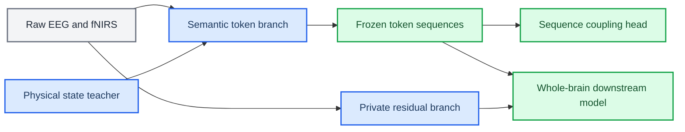

# Physiology-semantic tokenizer redesign archive

_Approved design baseline before implementation, 2026-07-01_

---

## 📋 Status and authority

This directory freezes the design decision reached after the tokenizer coupling lineage, information-retention audits, whole-brain downstream probes, and theoretical review. It defines the **approved target architecture** but does not claim that the target has been implemented or experimentally validated.

The currently runnable implementation remains documented in [`docs/ARCHITECTURE.md`](../ARCHITECTURE.md). When the current implementation conflicts with this directory, use the distinction below:

| Question | Authoritative document |
| --- | --- |
| What code runs today? | [`docs/ARCHITECTURE.md`](../ARCHITECTURE.md) |
| Why is the old design being retired? | [`01_LEGACY_DESIGN_POSTMORTEM.md`](01_LEGACY_DESIGN_POSTMORTEM.md) |
| What architecture should be implemented? | [`02_TARGET_ARCHITECTURE.md`](02_TARGET_ARCHITECTURE.md) |
| What theoretical claims justify it? | [`03_THEORETICAL_FOUNDATIONS.md`](03_THEORETICAL_FOUNDATIONS.md) |
| How should code and tests change? | [`04_IMPLEMENTATION_VALIDATION_PLAN.md`](04_IMPLEMENTATION_VALIDATION_PLAN.md) |
| Which experiments can validate or falsify it? | [`05_EXPERIMENT_DESIGN.md`](05_EXPERIMENT_DESIGN.md) |
| Which target-architecture experiments have run? | [`06_EXPERIMENT_LOG.md`](06_EXPERIMENT_LOG.md) |

> 📌 **Transition rule:** A target-architecture statement becomes a current-architecture statement only after its code, tests, smoke run, and module-level validity gate all pass.

## 🎯 Design decision

The redesign separates three responsibilities that the previous tokenizer attempted to solve with one hard-token coupling mechanism:

1. A **semantic token branch** represents physiologically interpretable state regions.
2. A **private/residual branch** preserves information not explained by the semantic state model.
3. A frozen-token **sequence-to-distribution coupling head** estimates incremental EEG-to-fNIRS predictive structure without modifying token identity.

## 🔍 Evidence boundary

The archived evidence supports redesign, not success of the redesign. In particular:

- the existing architecture can produce statistically positive global coupling while failing most task-local checks;
- soft assignments retain more usable cross-modal structure than hard IDs or quantized embeddings;
- strong pre-quantization EEG-to-fNIRS exchange can make conditional plots look cleaner without establishing independent physiological correspondence;
- current whole-brain token pretraining learns dataset/source style more reliably than fine-grained task state;
- current cache supervision exposes decoded source waveforms to the tokenizer but not the saved physical-state posterior and its uncertainty.

These findings motivate the target design. They do not prove that the physical-state teacher, semantic codebooks, or sequence coupling head will pass their planned gates.

## 🔗 Related records

- [`2026-07-01 physiology-semantic redesign`](../architecture_changelog/2026-07-01_physiology_semantic_tokenizer_redesign.md)
- [`Archived tokenizer coupling responsibility boundary`](../archive/pre_physiology_semantic_20260701/source_observation/TOKENIZER_COUPLING_RESPONSIBILITY.md)
- [`Archived physiological coupling plan`](../archive/pre_physiology_semantic_20260701/source_observation/PHYSIOLOGICAL_COUPLING_PLAN.md)
- [`Archived workflow reconstruction`](../archive/pre_physiology_semantic_20260701/research/workflow-reconstruction-cn/00_WORKFLOW_ARCHITECTURE.md)

_Last updated: 2026-07-01_
