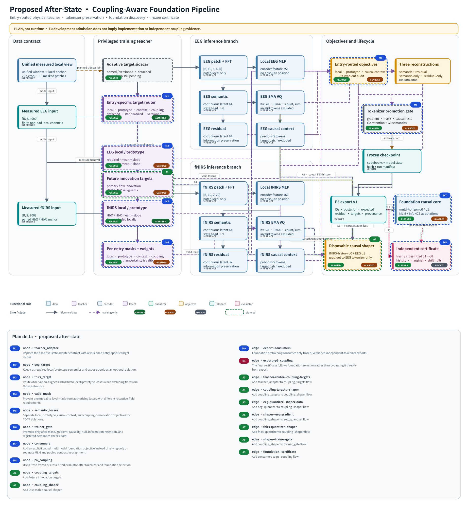
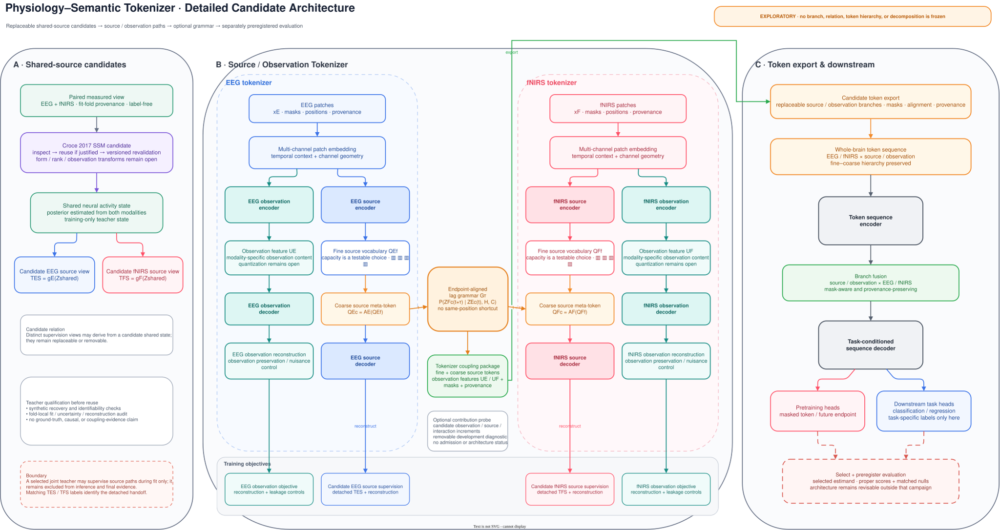
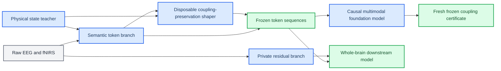

# Physiology-semantic tokenizer redesign archive

_Approved design baseline; full trainer implemented; sign-calibrated adaptive SSM physical teacher fully accepted_

---

## 📋 Status and authority

This directory freezes the design decision reached after the tokenizer coupling lineage, information-retention audits, whole-brain downstream probes, and theoretical review. It defines the **approved target architecture**. P1-P5 software interfaces and the full trainer are implemented. The 2026-07-24 final correction accepts the sign-calibrated adaptive joint SSM physical teacher and all of its physiological information, including fNIRS content: complete E0 is `PASS`, and physical-teacher supervision is authorized. Earlier Croce/E0-v2 and pre-calibration fNIRS error labels remain historical diagnostics only and carry no current E0 status. The 2026-07-19 entry routing still separates tokenizer preservation, foundation discovery, and independent certification; those later experiments do not qualify the E0 pass.

Raw-data shared-state diagnostics after the architecture visualization are archived under [`archive/diagnostics/`](archive/diagnostics/). They are evidence records, not new architecture chapters. The active status remains in [`06_EXPERIMENT_LOG.md`](06_EXPERIMENT_LOG.md); the authoritative complete-E0 decision is [`analysis/20260724_E0_SIGN_CALIBRATED_PHYSICAL_TEACHER_ACCEPTANCE.md`](analysis/20260724_E0_SIGN_CALIBRATED_PHYSICAL_TEACHER_ACCEPTANCE.md).

The current implementation remains the canonical runtime figure below. The
approved after-state is a separate plan artifact and must not be read as merged
code:

The currently runnable implementation remains documented in [`docs/ARCHITECTURE.md`](../ARCHITECTURE.md). When the current implementation conflicts with this directory, use the distinction below:

| Question | Authoritative document |
| --- | --- |
| What code runs today? | [`docs/ARCHITECTURE.md`](../ARCHITECTURE.md) |
| Why is the old design being retired? | [`01_LEGACY_DESIGN_POSTMORTEM.md`](01_LEGACY_DESIGN_POSTMORTEM.md) |
| What architecture should be implemented? | [`02_TARGET_ARCHITECTURE.md`](02_TARGET_ARCHITECTURE.md) |
| What theoretical claims justify it? | [`03_THEORETICAL_FOUNDATIONS.md`](03_THEORETICAL_FOUNDATIONS.md) |
| How should code and tests change? | [`04_IMPLEMENTATION_VALIDATION_PLAN.md`](04_IMPLEMENTATION_VALIDATION_PLAN.md) |
| Which experiments can validate or falsify it? | [`05_EXPERIMENT_DESIGN.md`](05_EXPERIMENT_DESIGN.md) |
| Which target-architecture experiments have run? | [`06_EXPERIMENT_LOG.md`](06_EXPERIMENT_LOG.md) |
| How are external comparative methods admitted and evaluated? | [`11_COMPARATIVE_METHOD_EXPERIMENT_WORKFLOW.md`](11_COMPARATIVE_METHOD_EXPERIMENT_WORKFLOW.md) |
| How is resource-bounded EFRM downstream performance frozen? | [`EFRM resource-bounded dual protocol`](../../comparative_methods/EFRM-PyTorch/sources/20260725_RESOURCE_BOUNDED_DUAL_PROTOCOL_FREEZE.md) |
| What exact code migration should be executed? | [`07_CODE_MIGRATION_PLAN.md`](07_CODE_MIGRATION_PLAN.md) |
| What does the current implementation look like? | [`08_ARCHITECTURE_VISUALIZATION.md`](08_ARCHITECTURE_VISUALIZATION.md) |
| Which target-architecture diagnostic records are archived? | [`archive/diagnostics/`](archive/diagnostics/) |

> 📌 **Transition rule:** A target-architecture statement becomes a current-architecture statement only after its code, tests, smoke run, and module-level validity gate all pass.

## 🎯 Design decision

The redesign separates three responsibilities that the previous tokenizer attempted to solve with one hard-token coupling mechanism:

1. A **semantic token branch** represents physiologically interpretable state regions.
2. A **private/residual branch** preserves information not explained by the semantic state model.
3. A training-only asymmetric shaper preserves broad delayed predictive information, a causal **foundation model** discovers contextual organization, and a fresh frozen evaluator certifies incremental EEG-to-fNIRS structure.

```mermaid
flowchart LR
    accTitle: Redesign responsibility split
    accDescr: The approved design separates physiological tokenization, training-only coupling preservation, foundation discovery, and independent frozen certification.

    raw_signal["Raw EEG and fNIRS"] --> semantic_tokens["Semantic token branch"]
    raw_signal --> residual_stream["Private residual branch"]
    physical_teacher["Physical state teacher"] --> semantic_tokens
    physical_teacher --> preservation["Disposable coupling-preservation shaper"]
    semantic_tokens --> preservation
    semantic_tokens --> frozen_tokens["Frozen token sequences"]
    preservation --> frozen_tokens
    frozen_tokens --> foundation_model["Causal multimodal foundation model"]
    foundation_model --> coupling_head["Fresh frozen coupling certificate"]
    frozen_tokens --> downstream_model["Whole-brain downstream model"]
    residual_stream --> downstream_model

    classDef current fill:#f3f4f6,stroke:#6b7280,stroke-width:2px,color:#1f2937
    classDef target fill:#dbeafe,stroke:#2563eb,stroke-width:2px,color:#1e3a5f
    classDef evaluation fill:#dcfce7,stroke:#16a34a,stroke-width:2px,color:#14532d

    class raw_signal current
    class physical_teacher,semantic_tokens,residual_stream,preservation,foundation_model target
    class frozen_tokens,coupling_head,downstream_model evaluation
```

## 🔍 Evidence boundary

The archived evidence supports redesign, not success of the redesign. In particular:

- the existing architecture can produce statistically positive global coupling while failing most task-local checks;
- soft assignments retain more usable cross-modal structure than hard IDs or quantized embeddings;
- strong pre-quantization EEG-to-fNIRS exchange can make conditional plots look cleaner without establishing independent physiological correspondence;
- current whole-brain token pretraining learns dataset/source style more reliably than fine-grained task state;
- current cache supervision exposes decoded source waveforms to the tokenizer but not the saved physical-state posterior and its uncertainty.

These findings motivate the target design. They do not prove that the physical-state teacher, semantic codebooks, or sequence coupling head will pass their planned gates.

## 🔗 Related records

- [`2026-07-01 physiology-semantic redesign`](../architecture_changelog/2026-07-01_physiology_semantic_tokenizer_redesign.md)
- [`Comparative-method experiment workflow`](11_COMPARATIVE_METHOD_EXPERIMENT_WORKFLOW.md)
- [`Physical-teacher gradient-entry decision`](analysis/20260719_PHYSICAL_TEACHER_GRADIENT_ENTRY_DECISION.md)
- [`Archived tokenizer coupling responsibility boundary`](../archive/pre_physiology_semantic_20260701/source_observation/TOKENIZER_COUPLING_RESPONSIBILITY.md)
- [`Archived physiological coupling plan`](../archive/pre_physiology_semantic_20260701/source_observation/PHYSIOLOGICAL_COUPLING_PLAN.md)
- [`Archived workflow reconstruction`](../archive/pre_physiology_semantic_20260701/research/workflow-reconstruction-cn/00_WORKFLOW_ARCHITECTURE.md)

_Last updated: 2026-07-19_
