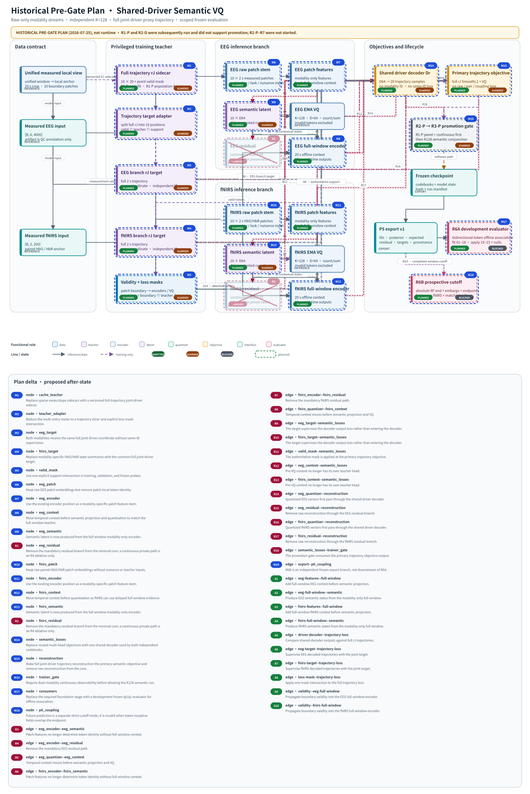
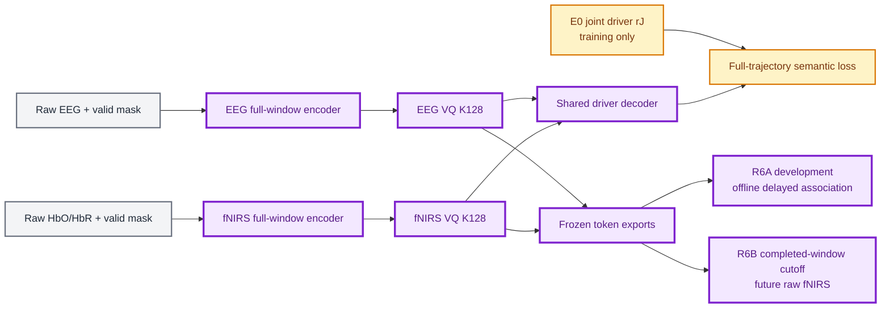

# Physiology-semantic tokenizer：当前研究入口

_2026-07-25 架构回归冻结；E2 runtime 已实现，新 SD-SVQ 架构尚待 R 系列验证_

---

## 📋 当前状态

E2 已完整展示旧架构的主要失败模式：固定 `K=128` 量化器本身保持健康，但以 raw reconstruction 为主、物理 teacher 为弱权重多入口辅助目标时，teacher 没有带来预注册 semantic endpoint 增益。该结果不支持继续堆叠 state/prototype/context/coupling heads。

新的目标架构 **Shared-Driver Semantic VQ（SD-SVQ）** 恢复原始项目的核心纪律：两个 tokenizer 分别只看本模态原始生理测量，使用独立 `K=128, D=64` codebook，不进行 same-ID 或跨模态 feature exchange。与最初 raw VQ 不同的是，两侧都以 E0 完整联合共享驱动代理轨迹 \(r^J\) 为主要 semantic 目标。冻结 token 后，可按主张选择 R6A 离线时延条件关联和/或独立的 R6B completed-window 窗外预测。

这是一份计划，不是已实现结果：

当前 E2 runtime 仍由 canonical 图描述：

## 🧭 文档权威

| 问题 | 权威文档 |
| --- | --- |
| 当前代码实际运行什么？ | [当前架构](../ARCHITECTURE.md) |
| 新架构是什么？ | [目标架构](02_TARGET_ARCHITECTURE.md) |
| 理论上为何这样简化？ | [理论基础](03_THEORETICAL_FOUNDATIONS.md) |
| 曲折探索带来了什么认识？ | [架构回归与方法启示](12_ARCHITECTURE_RETURN_AND_METHOD_LESSONS.md) |
| 代码如何迁移和验证？ | [实现与验证计划](04_IMPLEMENTATION_VALIDATION_PLAN.md) 与 [迁移计划](07_CODE_MIGRATION_PLAN.md) |
| 新实验怎样运行和停止？ | [R0–R7 实验设计](05_EXPERIMENT_DESIGN.md) |
| E0–E2 到底运行了什么？ | [实验日志](06_EXPERIMENT_LOG.md) |
| 图的 current/plan 状态如何区分？ | [架构视觉化规范](08_ARCHITECTURE_VISUALIZATION.md) |
| 对比方法如何进入正式比较？ | [比较方法工作流](11_COMPARATIVE_METHOD_EXPERIMENT_WORKFLOW.md) |
| 对比方法什么指标才可进入论文主表？ | [最终性能数字准入规则](13_COMPARATIVE_METHOD_FINAL_METRIC_ACCEPTANCE.md) 与 [机器可读目标](../../comparative_methods/comparison_metric_targets_v1.yaml) |
| 四条研究支路如何相互影响？ | [项目演进图](../PROJECT_EVOLUTION_MAP.md) |

dated `analysis/` 与旧 overlay 保留其当时语义。后来的 corrigendum 可以纠正口径，但不得改写原 run、配置或数值。

## 🎯 拟议的最小核心

```mermaid
flowchart LR
    accTitle: 拟议回归架构的责任分离
    accDescr: 计划中的原始 EEG 和 fNIRS 路径分别进入独立整窗编码器和 K128 量化器，共同重建一个训练期联合共享驱动代理坐标；冻结后由独立评估器检验增量关联。

    eeg["Raw EEG + valid mask"] --> enc_e["EEG full-window encoder"] --> vq_e["EEG VQ K128"]
    fnirs["Raw HbO/HbR + valid mask"] --> enc_f["fNIRS full-window encoder"] --> vq_f["fNIRS VQ K128"]
    teacher["E0 joint driver rJ<br/>training only"] --> loss["Full-trajectory semantic loss"]
    vq_e --> decoder["Shared driver decoder"] --> loss
    vq_f --> decoder
    vq_e --> frozen["Frozen token exports"]
    vq_f --> frozen
    frozen --> offline["R6A development<br/>offline delayed association"]
    frozen --> cutoff["R6B completed-window cutoff<br/>future raw fNIRS"]

    classDef measured fill:#f3f4f6,stroke:#6b7280,stroke-width:2px,color:#1f2937
    classDef planned fill:#f3e8ff,stroke:#7e22ce,stroke-width:3px,color:#581c87
    classDef teacherClass fill:#fef3c7,stroke:#d97706,stroke-width:2px,color:#78350f
    classDef evaluation fill:#dcfce7,stroke:#16a34a,stroke-width:2px,color:#14532d

    class eeg,fnirs measured
    class enc_e,vq_e,enc_f,vq_f,decoder planned
    class teacher,loss teacherClass
    class frozen,offline,cutoff planned
```

上述节点均为 planned。首轮计划不包含 discrete nuisance/effect token、shared codebook、same-ID loss、InfoNCE、cross-attention、coupling shaper 和 foundation model。continuous private branch 只在 R4 证明必要时进入。

## 🔍 E2 口径

- validation 总体：300 windows、3,000 patches；
- teacher sidecar：50 windows、500 patches，占总体 `16.67%`；
- 历史 frozen EEG probe：旧 artifact policy 下 `178/500`；
- teacher semantic loss 当时实际使用 500 target patches，因为没有与 signal mask 相交。

当前 policy 已取消 artifact mask 的 invalidity authority，因此新 R 系列必须重跑 `N0`，不能把旧 T0 当作匹配基线。完整更正见 [E2 corrigendum](analysis/20260725_E2_FAILURE_MODE_CORRIGENDUM_AND_RETURN_DECISION.md)。

## 🔐 研究声明边界

当前只授权：

- E2 的弱辅助 teacher 入口没有带来指标增益；
- `K=128` 是冻结的容量预算和健康的软件基础；
- \(r^J\) 是值得严格检验的 privileged joint proxy；
- SD-SVQ 是尚未通过 R2/R3 的目标架构。

当前不授权：

- shared driver 是生理 ground truth；
- 重建同一 teacher 已经发现 coupling；
- 相同 token ID 具有跨模态同义性；
- R 系列或 protected test 已通过。

> 架构状态升级规则：只有代码/tests、R1-P population-frozen teacher panel 与 development coverage、R2-P continuous observability 和 R3-P 合取门通过，SD-SVQ 才可从 plan 升级为 current runtime。
