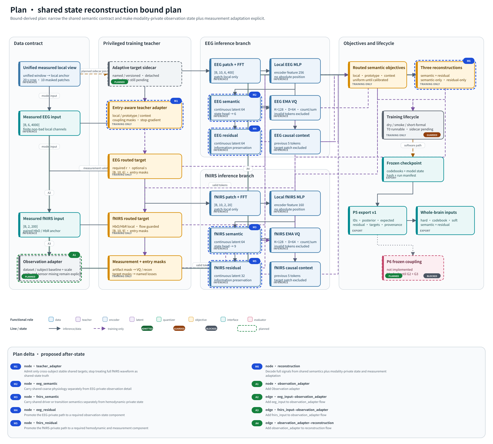

# Shared-state reconstruction bound diagnostic

_Croce-independent validation analysis; diagnostic only; protected test closed_

---

## Decision

The current dataset does **not** support the strong requirement that one low-dimensional, cross-subject-stable state, inferable from either modality, should reconstruct both EEG and fNIRS observations. It does support a narrower architecture in which a shared semantic or causal driver is combined with modality-private observation state, modality-specific dynamics, and an explicit dataset/subject measurement adapter.

This result does not rescue E0-v2 and does not justify opening the protected test. It changes the requirement that should be imposed on the next physical-teacher candidate.

## What “lower bound” means here

Without fixing latent capacity, input access, causality, decoder family, and subject generalization, a reconstruction-error lower bound is undefined: an unrestricted latent can copy both signals and obtain zero error. This experiment therefore reports three distinct quantities.

1. `validation_oracle_joint_pca` is the algebraic minimum for rank-$k$ linear reconstruction of the observed validation matrix after the declared baseline correction and feature scaling. It sees the validation matrix and both modalities, so it is an optimistic model-class lower bound, not a deployable estimator.
2. `train_fitted_joint_pca` estimates how that low-rank representation generalizes from subjects 1–18 to subjects 19–23.
3. `cca_joint_shared`, `cca_eeg_inferred`, and `cca_fnirs_inferred` require the state axes to come from cross-modal correlated structure. These are achievable held-out errors, not strict lower bounds.

`separate_modality_pca_k_each` is the private-state reference. Its advantage over CCA measures how much reconstructable structure is modality-private under this experiment, not how much is necessarily non-physiological.

## Protocol

The analysis used the paired optical-wavelength Croce cache only as an auditable container for the original observations; it did not use `state_estimates`, `source_eeg`, or reconstructed fNIRS outputs. Subjects 1–18 were used for fitting and subjects 19–23 for validation. Subjects 24–29 remained unopened.

Each of eight spatial anchors contributed four event windows. Only event-relative 0–20 s was retained, rather than the full overlapping 50 s cache windows. A train-independent baseline was removed using event-relative −10–0 s. Each retained interval was divided into non-overlapping 2 s patches, yielding 5,760 training rows and 1,600 validation rows. Models were fitted per anchor and aggregated over anchors with subject-level bootstrap intervals.

Two representations were tested:

- `waveform`: six EEG channels at 200 Hz and two optical fNIRS channels at 10 Hz, flattened within each 2 s patch;
- `descriptor`: per-channel mean, standard deviation, slope, endpoint change, and fixed spectral-band powers.

Latent dimensions were 1, 2, 3, 5, 8, 16, 32, and 64. Modalities were weighted equally in joint PCA so EEG's larger sample dimension could not dominate solely by feature count.

## Five-dimensional result

The five-dimensional point matches the number of coordinates in the current Croce state. All MSE values are in train-fitted, feature-wise standardized space.

| Representation and estimator | EEG MSE | EEG $R^2$ | fNIRS MSE | fNIRS $R^2$ |
| --- | ---: | ---: | ---: | ---: |
| Waveform, validation-oracle rank-5 PCA | 0.537 | 0.162 | 0.0147 | 0.973 |
| Waveform, train-fitted rank-5 PCA | 0.592 | 0.076 | 0.0230 | 0.972 |
| Waveform, rank-5 CCA shared state | 0.631 | 0.015 | 0.908 | 0.031 |
| Waveform, separate rank-5 PCA per modality | 0.546 | 0.147 | 0.000064 | 0.99993 |
| Descriptor, validation-oracle rank-5 PCA | 0.207 | 0.893 | 0.0466 | 0.931 |
| Descriptor, train-fitted rank-5 PCA | 0.317 | 0.835 | 0.127 | 0.880 |
| Descriptor, rank-5 CCA shared state | 1.741 | 0.098 | 1.173 | −0.222 |
| Descriptor, separate rank-5 PCA per modality | 0.231 | 0.880 | 0.0314 | 0.965 |

The subject-bootstrap 95% intervals for the validation-oracle rank-5 MSE were `[0.226, 1.079]` for EEG waveform, `[0.0064, 0.0230]` for fNIRS waveform, `[0.125, 0.326]` for EEG descriptors, and `[0.0247, 0.0674]` for fNIRS descriptors. With five validation subjects, these intervals characterize subject variability but are not population-precision claims.

## Why the optimistic joint result is not evidence for a shared state

At $k=5$, the median ratio between the smaller and larger modality loading energy was only `0.016` for waveform PCA and `0.041` for descriptor PCA. The nominally joint components were therefore overwhelmingly modality-dominated. They achieved low error by allocating axes to different modalities, not by discovering five balanced shared axes.

CCA makes the sharedness requirement explicit. Its mean first-five canonical correlation was `0.549` for waveforms and `0.516` for descriptors on training subjects, but only `0.090` and `0.004`, respectively, on validation subjects. The descriptor result is effectively non-generalizing. The waveform correlation is small and insufficient for reconstruction.

Single-modality inference confirms the problem:

| Direction at $k=5$ | Waveform target $R^2$ | Descriptor target $R^2$ |
| --- | ---: | ---: |
| EEG-derived shared state → fNIRS | −0.017 | −0.631 |
| fNIRS-derived shared state → EEG | −0.025 | −0.035 |

This does not prove that no physiological coupling exists. It shows that the current paired event windows do not expose a stable, same-patch, linear shared representation that generalizes across held-out subjects. Possible contributors include subject-specific neurovascular transfer, sensor mixing, event alignment, the different modality bandwidths, nonlinear coupling, and delayed rather than simultaneous dependence.

## Relation to the E0-v2 failure

The E0-v2 fNIRS physical-observation mean had standardized MSE `2.193` versus a history baseline of `0.834`. Those numbers are not directly comparable to this run because E0-v2 used sample normalization while this analysis used event-baseline correction plus train-fitted feature scaling.

The qualitative comparison is still informative. Current fNIRS observations are extremely low-rank within their own modality: five private waveform components achieved validation $R^2=0.99993$. Therefore the E0 failure is not well explained by fNIRS being intrinsically unreconstructable. The failure is more consistent with the imposed shared-state/forward-observation contract, calibration, or subject-specific measurement mapping being wrong for the data.

## Revised physical-teacher requirements

The next teacher should be evaluated against capacity-matched, data-derived references rather than an absolute waveform threshold.

1. **Shared target admission:** only coordinates with held-out-subject cross-modal evidence above a time-shift or pairing-permutation reference may supervise shared token identity. Training-only canonical correlation is insufficient.
2. **Private-state allowance:** full EEG and fNIRS reconstruction must be allowed to use modality-private state or residual paths. Shared semantics alone should reconstruct only the component demonstrably common across modalities.
3. **Multi-timescale causality:** represent a neural driver, hemodynamic transition state, and observation state separately. Evaluate delayed EEG-history → fNIRS-innovation information rather than demanding a single same-time state.
4. **Measurement adaptation:** baseline, scale, wavelength mixing, and subject/dataset effects must be explicit, reversible, and estimated without protected data. They should not be absorbed into the shared token.
5. **Bound-relative reporting:** report excess error above the validation-oracle rank-$k$ floor, the gap to the private-state reference, and the CCA/shared generalization gap for every capacity. No single hard-coded threshold is promoted from this diagnostic.
6. **Teacher-family controls:** compare Croce-only, data-driven multi-view dynamical, and physics-regularized hybrid teachers. A shared-state claim requires convergence across families or a mechanistic reason for disagreement.

## Architecture direction

The supported minimal change is:

\[
Z_t^{shared}=g(E_{\le t},F_{<t}),\qquad
Z_t^E=g_E(E_{\le t}),\qquad
Z_t^F=g_F(F_{\le t}),
\]

\[
\hat E_t=D_E(Z_t^{shared},Z_t^E,A_{d,s}^E),\qquad
\hat F_t=D_F(H(Z_{\le t}^{shared}),Z_t^F,A_{d,s}^F),
\]

where $H$ is a delayed hemodynamic transition and $A_{d,s}^m$ is an auditable measurement adapter. Shared tokens are supervised by admitted coarse state or transition targets. Modality-private residual/state paths carry waveform detail and observation nuisance. Frozen coupling evaluation remains downstream and cannot be rescued by teacher-imposed alignment.

## Artifacts and reproducibility

- Formal diagnostic run: [`20260706_105937_shared_state_reconstruction_bound_v1`](../../../../experiments/runs/physiology_semantic_tokenizer/e0_teacher_validity/20260706_105937_shared_state_reconstruction_bound_v1/)
- Configuration: [`shared_state_reconstruction_bound.yaml`](../../../../experiments/configs/physiology_semantic_tokenizer/shared_state_reconstruction_bound.yaml)
- Analysis implementation: [`evaluate_shared_state_reconstruction_bound.py`](../../../../experiments/evaluate_shared_state_reconstruction_bound.py)
- Complete metrics: [`metrics.csv`](../../../../experiments/runs/physiology_semantic_tokenizer/e0_teacher_validity/20260706_105937_shared_state_reconstruction_bound_v1/metrics.csv)
- Capacity figures: [`waveform`](../../../../experiments/runs/physiology_semantic_tokenizer/e0_teacher_validity/20260706_105937_shared_state_reconstruction_bound_v1/figures/capacity_curve_waveform.svg), [`descriptor`](../../../../experiments/runs/physiology_semantic_tokenizer/e0_teacher_validity/20260706_105937_shared_state_reconstruction_bound_v1/figures/capacity_curve_descriptor.svg)

**Status:** supports revising the teacher and observation architecture; does not support passing E0, starting physical-state-supervised tokenizer training, or opening protected subjects.
