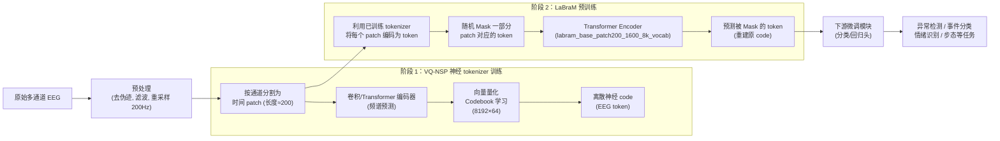
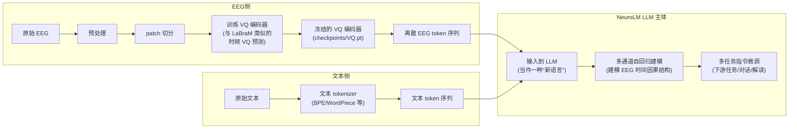
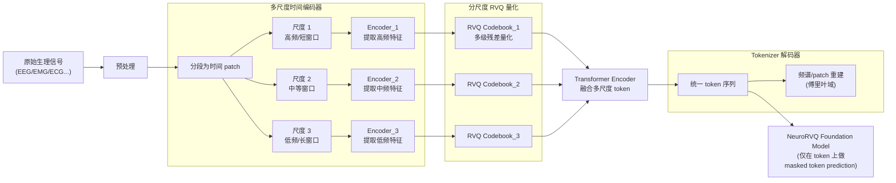
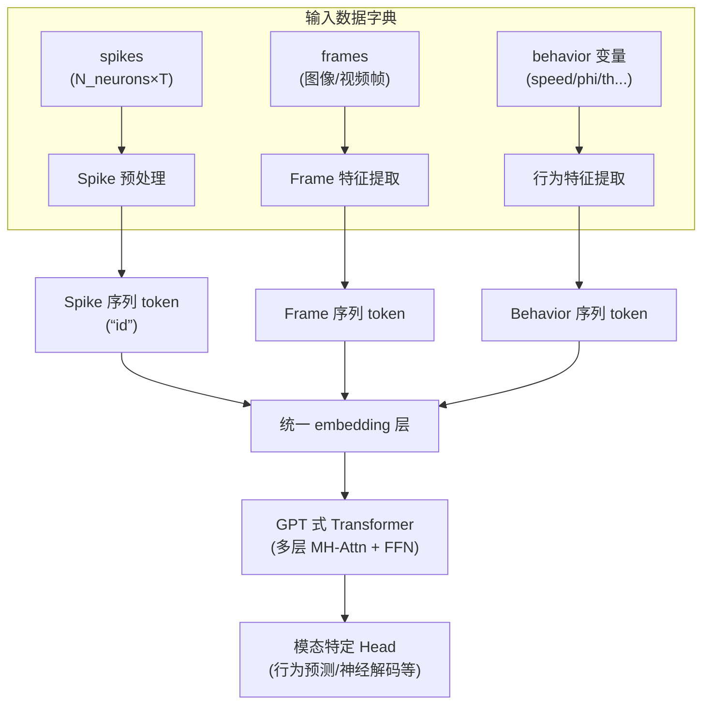

# Existing EEG Foundation Model Tokenizer Designs and Author Motivations

---

## 1. LaBraM 系列：VQ 神经频谱 Tokenizer

### 1.1 LaBraM：Vector-Quantized Neural Spectrum Prediction Tokenizer

**代表工作**

- Large Brain Model (LaBraM) – ICLR 2024[1]

**具体 tokenization 方法**

- 输入：多通道 EEG \(X \in \mathbb{R}^{C\times T}\)。
- 步骤：
  1. **按通道/时间切成 EEG channel patches**：
     - 将连续 EEG 在时间上切成固定长度的 patch，并在通道维度上按“channel patch”组织；
  2. **神经频谱预测**：
     - 用一个神经网络预测每个 patch 的频域表示（幅值 A、相位 φ 等），得到连续的“神经频谱 latent”；
  3. **向量量化 (VQ)**：
     - 训练一个 codebook \(V \in \mathbb{R}^{K \times D}\)（文献中 K≈8192 量级），
     - 对每个 patch 的 latent 做 nearest-neighbor 分配，得到一个离散索引（EEG token）：
       \[
       z_i = \arg\min_{k} \|e_i - v_k\|^2
       \]
  4. **预训练目标**：
     - 用这些离散“神经码”作为预测目标，做“masked neural code prediction”：
       - 随机 mask 掉部分 patch 的 code，
       - Transformer 输入未 mask 的 patch embedding，预测被 mask 的 code（类似 BEiT / masked image modeling）。

**作者给出的主要理由**

- **解决数据异构性，支持跨数据集预训练**：
  - EEG 数据集之间在电极数、采样率、试次长度、任务设计上差异巨大，直接在时域建模难以统一；
  - 通过“切 patch + VQ codebook”，将各种原始格式统一成**同一离散 token 空间**，便于在 20 余个数据集上统一预训练[1]。
- **获得“语义丰富”的神经 tokens**：
  - 神经频谱预测 + VQ，使 codebook 中每个 code 对应一个具有特定频谱模式的“神经 token”，
  - 作者认为这比简单的时域 patch 更能捕获与任务相关的振荡模式（如 α/β/γ 等）。
- **压缩与效率**：
  - 将高维连续 EEG patch 压缩为一个离散索引（或少量向量），大幅减少下游 Transformer 的输入长度和维度；
  - 便于训练更深更宽的 Transformer backbone。
- **统一 pretext 任务**：
  - 通过“预测离散神经码”而不是重建原始波形，使预训练目标更稳定，也更贴近类似 NLP 的 masked token prediction。

---

### 1.2 LaBraM++：改进版 Codebook Tokenizer（频谱+相位友好）

**代表工作**

- LaBraM++: Advancing Brainwave Modeling with a Codebook-Based Tokenizer[2]

**tokenization 方法（相对 LaBraM 的关键改动）**

- 仍然是 **“channel patch → 频谱预测 → VQ codebook → 离散 token”** 这条线，
- 但在频谱建模上**明确改进了相位表示和损失**：
  - 用 \(\sin(\phi), \cos(\phi)\) 代替直接回归相位 φ，避免相位在 \(-\pi, \pi\) 处的不连续；
  - 引入更稳定的相位/幅度联合损失，提升重建精度和训练稳定性。

**作者给出的理由**

- **现有模型没充分利用神经振荡信息**：
  - 许多早期 foundation model 在频谱/相位上设计不够合理，导致对神经振荡（oscillations）的信息利用不足；
- **改善重建 & 泛化**：
  - 更精确的相位/幅度重建 → 更真实的频谱表示 → 更泛化的 EEG 表征；
- **保持 LaBraM 的优点**，同时：
  - 通过更“信号处理友好”的频谱建模，让 codebook 学到的 token 更接近真正的神经波形模式。

---

## 2. NeuroRVQ：多尺度残差 VQ Tokenizer

**代表工作**

- NeuroRVQ: Multi-Scale EEG Tokenization for Generative Large Brainwave Models[3][4]

**具体 tokenization 方法**

- 核心是一个**“多尺度 + 残差 VQ (RVQ)” 的 codebook-based tokenizer**。
- 设计要点：
  1. **多尺度特征提取**：
     - 使用 Inception-style 并行卷积分支，对 patch 进行多尺度卷积；
     - 每个分支专门捕捉特定频段（例如 δ/θ/α/β/γ），得到多路 latent。
  2. **每个分支配一个 RVQ codebook**：
     - 每个频段分支都用一个层次残差 VQ 码本进行量化：
       \[
       e \rightarrow q_1(e) \rightarrow r_1 = e - q_1(e) \rightarrow q_2(r_1) \rightarrow \dots
       \]
     - 这样可以用多个 code 级联表示一个 patch 的细致结构。
  3. **相位+幅度感知损失**：
     - 使用专门的损失同时拟合：
       - 幅度的 log-loss；
       - 相位的 \(\sin/\cos\) 重建；
       - 保证重建信号在各频带上都逼近真实 EEG。
  4. **预训练任务**：
     - 随机 mask 掉一部分 patch；
     - 让 LBM 预测被 mask patch 的多分支 RVQ tokens（generative masked modeling）。

**作者给出的理由**

- **现有 tokenizer 无法保留高频动态**：
  - 他们指出，现有神经 tokenizer（包括 LaBraM）在**高频信息**上重建误差较大，导致生成/重建 EEG 失真[3][4]；
- **多尺度 + 每频段单独码本**：
  - 通过 Inception-style 多尺度分支 + 每分支一个 RVQ codebook，可以更好地区分和编码不同频带的神经活动；
- **高分辨率编码 & 高频保真**：
  - 残差 VQ 允许用多个 code 累加表示复杂的细节，特别是高频部分；
- **通用 codebook 先验**：
  - 论文明确强调：这种 tokenizer 为“**通用脑波 codebook**”提供了强先验，有利于未来的神经解码、生成建模和**多模态生物信号整合**[3]。

---

## 3. NeuroLM：文本对齐的 VQ Tokenizer

**代表工作**

- NeuroLM: A Universal Multi-task Foundation Model for Bridging the Gap between Language and EEG Signals[5]

**具体 tokenization 方法**

- **text-aligned neural tokenizer**，核心也是：

  > “vector-quantized temporal-frequency prediction, which encodes EEG signals into discrete neural tokens”[5]

- 步骤概括：
  1. 对 EEG 做时间–频率嵌入（temporal-frequency embedding）；
  2. 用 VQ 编码器学习一个 codebook，将这些嵌入量化为离散 token；
  3. 这些 EEG tokens 被看作一种“外语”，喂入 LLM；
  4. LLM 用自回归方式建模这些 token 序列（类似语言建模）。

**作者给出的理由**

- **把 EEG “翻译”成 LLM 能理解的 token 序列**：
  - 通过 VQ，把连续 EEG 表示转化为 discrete tokens，从而可以直接接驳已有 LLM 架构；
- **多任务统一 & 指令微调**：
  - 把 EEG token 当成“词”，就能在一个大模型里统一处理多种 EEG 任务，并用 instruction-tuning 的范式来做多任务适配；
- **参数效率**：
  - VQ tokenizer 冻结后，下游只需要在 LLM 一侧做少量微调；
- **跨模态对齐**：
  - “text-aligned” 的设计允许在 EEG token 与文本 token 之间共享或对齐 embedding 空间，支持 EEG–语言联学。

---

## 4. CodeBrain：TFDual-Tokenizer（解耦时域/频域的双码本）

**代表工作**

- CodeBrain: Bridging Decoupled Tokenizer and Multi-Scale Architecture for EEG Foundation Models[6]

**具体 tokenization 方法**

- 第一阶段是 **TFDual-Tokenizer**：
  - **输入**：EEG patch \(X \in \mathbb{R}^{C \times T \times N}\)；
  - **Time–Frequency Encoding**：
    - 同时处理时域信号和频域（DFT）得到联合时频 embedding \( \tilde{e}_n \)；
    - 通过 TransformerEncoder 进一步编码；
  - **双码本 VQ**：
    - 时间码本 \(V^{(t)}\)、频率码本 \(V^{(f)}\) 各自学习：
      \[
      z_i^{(t)} = \arg\min_j \|\tilde{e}_i - v_j^{(t)}\|^2,\quad z_i^{(f)} = \arg\min_j \|\tilde{e}_i - v_j^{(f)}\|^2
      \]
  - **损失设计**：
    - 频率分支：重建幅度 A 和相位 φ（频域 MSE）；
    - 时间分支：SimCLR 风格的对比损失 + 时域重建；
    - 加上 codebook matching / commitment 损失；
- 第二阶段：用这些离散 token 作为预测目标，训练 multi-scale EEGSSM backbone。

**作者给出的理由**

- **解耦“时域形状”和“频域节律”**：
  - 一个单一的 codebook 难以同时捕获时域细节和频域节律；
  - 通过 time/frequency 双码本，能在两个域里分别学习模式；
- **判别力更强**：
  - 他们在附录里展示：解耦双码本相比单一码本，得到更高比例的“类别特异性 tokens”，即某些 code 几乎只在特定类别中激活[6]；
- **可解释性**：
  - 频率 codebook 的 token 可以直接对应到特定频带/节律，时间 codebook 对应到典型波形结构，易于与神经事件和频段节律建立联系；
- **表示空间“平方级扩展”**：
  - 每个 patch 有一个时间 token + 一个频率 token，组合空间相当于 \(K^2\)，理论上更强的表达能力。

---

## 5. TFM-Tokenizer：单通道时频动机 Tokenizer

**代表工作**

- Tokenizing Single-Channel EEG with Time-Frequency Motif Learning (TFM-Tokenizer)[7]

**具体 tokenization 方法**

- **目标**：从单通道 EEG 中学习“时频动机”（time-frequency motifs）的离散词表。
- pipeline 概述：
  1. 对每个通道，切成重叠窗口（长度 L，步长 H），得到 N 个 patch；
  2. 对每个窗口算 STFT 得到局部频谱窗 \(S_i\)；
  3. **频率路径**（Localized Spectral Window Encoder）：
     - 把 \(S_i\) 在频率轴上进一步分成若干频率 patch；
     - 线性/卷积映射到 embedding，然后通过 Frequency Transformer 建模频率间依赖；
     - 经过 gated 聚合得到频率 embedding \(E_i^F\)；
  4. **时间路径**：
     - 对原始时域 patch \(x_i\) 做卷积/线性编码得到时间 embedding \(E_i^T\)；
  5. **融合 + Temporal Transformer**：
     - 拼接 \(E_i^F, E_i^T\)，输入 Temporal Transformer 获得融合 embedding \(Z_i\)；
  6. **VQ 量化为 token**：
     - 用单一 codebook（K=8192, D=64）对 \(Z_i\) 做最近邻量化，得到离散 token；
- 训练：
  - 用**时频掩蔽的谱重建目标**（masked spectrogram reconstruction）+ 标准 VQ 损失（code / commitment）。

**作者给出的理由**

- **时频动机级别的抽象**：
  - EEG 中许多有意义的模式既局限于特定时间窗，又局限于特定频段，单纯时域或单纯频域都不够；
  - 通过时域+频域双路径 + Transformer 聚合，token 对应的就是“时频动机”；
- **设备无关（single-channel 设计）**：
  - Tokenizer 在单通道上学习词表，而不是依赖固定 10–20 布局；
  - 有利于适配异构设备（如耳 EEG），作者在耳 EEG 睡眠分期上验证其跨设备效果[7]；
- **可解释性**：
  - 他们对 token 进行分析，发现 token 具有：
    - 强类别判别性；
    - 对频段敏感；
    - 结构稳定（不同数据集上结构相似）；
- **通用“插件式”组件**：
  - 作为 plug-and-play 的 tokenizer，可以提升多种 foundation model（包括 BIOT, LaBraM）的性能。

---

## 6. CSBrain：Cross-scale Spatiotemporal Tokenization (CST)

**代表工作**

- CSBrain: A Cross-scale Spatiotemporal Brain Foundation Model for EEG Decoding[8]

**具体 tokenization 方法**

- **目标**：在 token 层面显式编码 EEG 的**多时间尺度 + 多空间尺度结构**。
- CST 由两部分组成：
  1. **Temporal Tokenization（多尺度时间卷积）**：
     - 对每个时间位置 i，在其局部时间窗 \(W_t^{(k)}(i)\) 上，用不同 kernel size \(s_t^{(k)}\) 的一组 1D conv（k=1..K）；
     - 把多尺度卷积输出拼接，再加 residual projection 得到时间跨尺度 token \(\hat{x}_{i,j}^{(l)}\)。
  2. **Spatial Tokenization（多尺度空间卷积）**：
     - 先按 10–20 电极布局把通道划分为脑区；
     - 在每个脑区内，对通道 j 的附近邻域 \(W_s^{(k)}(j)\) 用多尺度 1D conv 进行空间卷积；
     - 同样拼接 + projection 得到最终跨尺度 token \(\tilde{x}_{i,j}^{(l)}\)。
- Embedding 维度分配：
  - 不同尺度的通道数 \(d_k\) 按 \(1/2^k\) 衰减，小尺度（局部）分配更多维度，大尺度（整体）分配较少。

**作者给出的理由**

- **现有 EFM 沿用 NLP/vision 的“单尺度稠密建模”不符合脑电特性**：
  - EEG 任务模式横跨从 ms 级短爆发到 s 级慢节律，从局部皮层到大范围网络；
- **跨尺度结构是关键 inductive bias**：
  - 显式在 token 层面建模“局部–中尺度–全局”有助于学到更泛化的表示；
- **同时考虑时间与脑区结构**：
  - CST 把时间上的多尺度窗口和脑区上的多尺度邻域统一编码进 token；
  - 为后续的 Structured Sparse Attention 提供“结构化 token 基座”。

---

## 7. EEG-DINO：TFE + 解耦位置的 tokenization

**代表工作**

- EEG-DINO: Learning EEG Foundation Models via Hierarchical Self-distillation[9]

**具体 tokenization 方法**

- 主要 tokenization 相关组件：
  1. **Time-Frequency Embedding (TFE)**：
     - 将多通道 EEG \(X \in \mathbb{R}^{C \times T}\) 切成 1 秒窗口；
     - 对每个窗口做时频嵌入，得到 EEG token \(E\)；
  2. **多视图 channel-aware 采样**：
     - 生成多种视图（global / local / masked），都通过 TFE 变成 token 序列；
  3. **Decoupled Positional Embedding (DPE)**：
     - 对 token 加上**空间通道位置编码 \(P_c\)** + **时间位置编码 \(P_t\)**：
       - \(P_c\)：对通道 one-hot 做线性投影；
       - \(P_t\)：沿时间轴做通道内 1D 卷积得到；
     - 最终 embedding：\(Embed(X) = P_c + P_t + E\)。

**作者给出的理由**

- **多视图自蒸馏需要统一的 token 表示**：
  - 不同视图（裁剪、mask 等）下，TFE 提供一致的 token 序列形式，便于做多视图语义对齐；
- **空间/时间位置解耦**：
  - EEG 既有通道拓扑，又有时间顺序，如果用单一 position embedding 会混淆两者；
  - DPE 单独建模空间与时间位置，更符合 EEG 结构；
- **鲁棒和多级语义**：
  - 多视图 + self-distillation + 结构化 token，使得模型能从 noisy EEG 中提取多层语义特征。

---

## 8. FoME：Time-Frequency Fusion Embedding（嵌入级 tokenization）

**代表工作**

- FoME: A Foundation Model for EEG using Adaptive Temporal-Lateral Attention Scaling[10]

**tokenization / embedding 方法**

- 摘要中给出的关键点：
  - 使用 **time-frequency fusion embedding technique** 把 EEG 映射到 time-frequency 融合 embedding；
  - 再通过自适应时间–横向注意力 (ATLAS)建模多通道 EEG。

虽然论文没有像 LaBraM 那样显式采用 VQ-codebook，但在 foundation model 语境下，这种 embedding 通常是**“patch 化 + 时频变换 + 线性投影”**的 continuous tokenization。

**作者给出的理由**

- **应对信号异质性和低 SNR**：
  - 同时引入时域与频域信息，让 embedding 对不同任务/数据集更稳健；
- **适配多种 EEG 类型（scalp + iEEG）**：
  - time-frequency 融合 embedding + adaptive attention，有助于自动适应不同通道分布与动态模式。

---

## 9. 小结：当前 EEG foundation model 中 tokenizer 设计的共识与差异

### 9.1 共识：为什么大家都在“tokenize EEG”

从上述工作可以看出，**几乎所有 EEG foundation model 都选择显式的 tokenization，而不是直接在原始波形上用大模型**。作者们给出的共识性原因可以概括为：

1. **表示统一与跨数据集学习**  
   - EEG 格式极度异质（通道、长度、任务），需要通过 patch + 嵌入 / VQ 把它们转化为统一 token 序列，才能做大规模预训练[1][3][7]。
2. **压缩与计算效率**  
   - 把高维连续波形压缩成较短的 token 序列（特别是 VQ 方式），可以训练更深更广的 Transformer / LLM，而不会被序列长度拖垮[1][3][5]。
3. **捕捉神经结构先验**  
   - 时频 tokenizer（LaBraM, TFM-Tokenizer, CodeBrain, NeuroRVQ）把频段、相位、局部时频动机显式编码，使得 token 本身具有“神经振荡/节律/脑区结构”的含义[1][3][6][7][8]。
4. **可解释性与可分析性**  
   - codebook 中的 token 可以分析使用频率、任务特异性、频段分布，进而与神经事件建立联系；这是连续 latent 不易做到的[6][7]。
5. **便于跨模态/跨任务扩展**  
   - 像 NeuroLM 把 EEG tokens 当“外语词”，直接喂给 LLM；
   - NeuroRVQ/LaBraM 则把 tokenizer 视为“通用脑波先验”，便于未来融合 fMRI、fNIRS 等其他模态[3][5]。

### 9.2 分歧：不同 tokenizer 之间的设计取舍

- **是否使用 VQ（离散）**  
  - LaBraM/NeuroRVQ/NeuroLM/CodeBrain/TFM-Tokenizer 都采用 VQ 离散 codebook；
  - FoME 等则更偏向 continuous embedding。  
  → 离散 token 更适合接驳 LLM、做 masked token prediction；连续 embedding 则实现更细粒度的回归/预测。
- **是否解耦时域/频域**  
  - CodeBrain 显式用双码本解耦；
  - LaBraM/NeuroRVQ/TFM 虽都有时频信息，但处理方式不同（如多分支 vs 动机级融合）。  
  → 解耦设计强调可解释与判别性；耦合设计强调整体表达力。
- **是否强调多尺度结构**  
  - CSBrain/NeuroRVQ/EEG-DINO 都强调多尺度；
  - 早期工作或部分模型则是单尺度 patch + Transformer。  
  → 越新的工作越倾向把脑信号的多尺度作为主导 inductive bias 写进 tokenizer。

---

## 10. 回答你的问题：现有 EEG foundation model 的 tokenizer 方法与作者动机总结

结合以上各篇代表性工作，可以给出一个直接、可操作的回答：

1. **主流 EEG foundation model 基本都用了“patch + 时频变换 +（可选）VQ codebook”的 tokenizer。**  
   - 其中 LaBraM、NeuroRVQ、NeuroLM、CodeBrain、TFM-Tokenizer 是典型的 **VQ codebook-based tokenizer**；
   - CSBrain、EEG-DINO、FoME 则偏重 **多尺度/结构化的 continuous tokenization**。

2. **具体 tokenization 设计大致沿三条主线演进：**
   - **LaBraM → LaBraM++ 系**：  
     - “channel patch + 神经频谱预测 + VQ codebook”，强化频谱/相位建模，用来统一多数据集，并得到语义丰富的离散神经 tokens[1][2]。
   - **NeuroRVQ / CodeBrain / TFM 系**：  
     - 在 LaBraM 思路上，进一步引入多尺度/时频解耦/单通道动机等设计，解决高频信息丢失、判别力不足、设备异构等问题[3][6][7]。
   - **CSBrain / EEG-DINO / FoME 系**：  
     - 更强调“跨尺度时空结构”的显式建模，token 本身就是“多时间尺度 + 空间脑区”聚合结果，而不局限于频谱重构[8][9][10]。

3. **作者给出的采用这些 tokenizer 的“核心理由”集中在四点：**

   - **（1）统一表示 & 可扩展性**：  
     把各异的 EEG 格式变成统一的 token 序列，支持大规模、多任务、多数据集预训练，是 foundation model 能成立的基本前提[1][3][5][7]。

   - **（2）抓住 EEG 的时频与多尺度本质**：  
     通过频谱预测、时频动机、多尺度卷积等，让 token 自带“频段、相位、局部节律、跨尺度结构”等神经生理语义，而不只是抽象的“向量块”[1][2][3][6][7][8]。

   - **（3）提升下游性能 & 泛化能力**：  
     几乎所有论文都报告：引入定制化 tokenizer 后，无论是分类、检出、生成，还是跨数据集/设备迁移，都能明显优于简单的“时域 patch + transformer”或普通 CNN[1][3][5][6][7][8][9][10]。

   - **（4）增强可解释性 & 面向脑科学应用**：  
     - 通过分析 codebook 使用分布、类别特异性 token、频段对应关系等，可以给出较清晰的“某类任务/状态对应哪些 token 模式”；
     - 对临床/神经科学研究者来说，这比黑盒连续特征更容易接受[6][7][8]。

若你后续想设计一个面向 EEG–fNIRS 的统一 codebook，多数作者的这些动机（统一表示、时频/多尺度、生理可解释性）都可以直接继承，并且在**“跨模态统一 token 空间”**这一点上，NeuroRVQ、LaBraM 系已经明确将“多模态生物信号集成”写入愿景，你可以把你的工作视为它们在多模态方向的自然延伸。

---

### References

[1] Large Brain Model for Learning Generic Representations with Tremendous EEG. <https://arxiv.org/abs/2405.18765>.  
[2] LaBraM++: Advancing Brainwave Modeling with a Codebook-Based Tokenizer. <https://arxiv.org/pdf/2505.16724.pdf>.  
[3] NeuroRVQ: Multi-Scale EEG Tokenization for Generative Large Brainwave Models. <https://arxiv.org/abs/2510.13068>.  
[4] NeuroRVQ (OpenReview version). <https://openreview.net/forum?id=m38Hle9Utx>.  
[5] NeuroLM: A Universal Multi-task Foundation Model for Bridging the Gap between Language and EEG Signals. <https://arxiv.org/abs/2409.00101>.  
[6] CodeBrain: Bridging Decoupled Tokenizer and Multi-Scale Architecture for EEG Foundation Model. <https://arxiv.org/abs/2506.09110>.  
[7] Tokenizing Single-Channel EEG with Time-Frequency Motif Learning (TFM-Tokenizer). <https://arxiv.org/abs/2502.16060>.  
[8] CSBrain: A Cross-scale Spatiotemporal Brain Foundation Model for EEG Decoding. <https://arxiv.org/abs/2506.23075>.  
[9] EEG-DINO: Learning EEG Foundation Models via Hierarchical Self-distillation. <https://papers.miccai.org/miccai-2025/paper/3347_paper.pdf>.  
[10] FoME: A Foundation Model for EEG using Adaptive Temporal-Lateral Attention Scaling. <https://arxiv.org/abs/2409.12454>.

---

## 1. LaBraM：VQ‑NSP 神经 tokenizer + EEG 专用 FM

### 1.1 整体数据流（从原始 EEG 到下游任务）

### 1.2 结构要点（tokenizer 侧）

- 输入：单通道 EEG patch（如 3×200×12 等配置）。
- 编码器：神经网络提取 patch 的时频特征。
- 向量量化：  
  - codebook 大小约 **8192**，维度 **64**。  
  - 使用 EMA / k‑means 初始化等策略稳定训练。
- 训练目标：**Neural Spectrum Prediction**  
  → 预测 patch 的频谱并通过 VQ 学习离散 code，使得每个 patch 被映射到一个 codebook 索引（神经 token）。
- 使用方式：  
  - 阶段 1：单独训练 tokenizer（`run_vqnsp_training.py`）。  
  - 阶段 2：冻结 tokenizer，只用离散 token 训练大 Transformer（masked token 预测）。

**一句话总结**：  
LaBraM 的 tokenizer 是「**单尺度 EEG patch → VQ‑NSP → 8192 类离散神经 token**」，FM 在 token 上做 BERT 式掩码重建。

---

## 2. NeuroLM：在 LaBraM 式 tokenizer 之上的「文本对齐」EEG‑LLM

### 2.1 多模态数据流（EEG & 文本）

### 2.2 结构要点（tokenizer 与 LLM 解耦）

- **EEG tokenizer**：
  - 类型：向量量化的时频预测（与 LaBraM 非常相似/兼容），得到离散 EEG token。
  - 训练：通过 `train_vq.py` 等脚本，先在大规模 EEG 上训练；训练好之后 **冻结**。
  - 输出：`checkpoints/VQ.pt`，在 NeuroLM 中只作为「前端编码器」。

- **LLM 部分**：
  - 把 EEG token 与文本 token 都当作「序列符号」，用一个统一的 LLM 来建模。
  - 对 EEG：做 **多通道自回归**，学习因果结构。
  - 对多任务：通过 `train_instruction.py` 进行 **指令微调**，在统一 token 空间中完成诊断、理解、BCI 等任务。

**一句话总结**：  
NeuroLM 在 LaBraM 类 tokenizer 之上，将 EEG token 视作「**与文字等价的离散语言**」，用一个 LLM 统一建模 EEG 与文本。

---

## 3. NeuroRVQ：多尺度 RVQ tokenizer + 小型 FM

### 3.1 多尺度 tokenization 数据流

### 3.2 结构要点（与 LaBraM/NeuroLM 的关键区别）

- 输入：任意多通道生理时间序列（EEG/EMG/ECG）。
- 多尺度编码：
  - 使用多尺度时间编码器：同一段信号被不同窗口长度/步长处理，分别提取高频/中频/低频特征。
- **残差向量量化 (RVQ)**：
  - 每个尺度都有自己的 RVQ codebook，分级量化残差：  
    第一层 code 量化主分量，后续层对残差再量化。
  - 输出：每个 patch 在每个尺度上得到一串 code index。
- Token 融合：
  - 不同尺度的 token 通过 Transformer encoder 融合，得到统一 token 序列。
- 训练目标：
  - tokenizer：重建输入 patch 的频谱；  
  - foundation model：在 token 序列上做 **masked token prediction**，学习长程依赖。

**一句话总结**：  
NeuroRVQ 把 LaBraM 单尺度 VQ 扩展为「**多尺度 + 分层残差量化**」，对 EEG/生理信号给出更丰富、更可扩展的 token 表征。

---

## 4. Neuroformer：统一 token 接口的多模态 GPT（非 VQ）

### 4.1 多模态数据 & token 接口

### 4.2 配置驱动的多模态机制

- 数据接口（Data Dictionary）：
  - `data['spikes']`: (N_neurons, N_timesteps) – 必需。
  - `data['frames']`: (N_frames, N_timesteps) – 可选。
  - `data['behavior vars']`: (N_timepoints,) – 可选。
- 模态配置（config）：
  - 每个模态可设置：
    - 是否作为输入 / 预测目标 (`predict: true/false`)；
    - 任务类型（回归 / 分类）；
    - 时间分辨率 dt 等。
- 对比学习 & 多任务：
  - 可指定对比学习变量列表，如：  
    `vars: ['id', 'frames', {'behavior': 'speed'}]`  
    表示 spike token、frame、speed 三者进行对比对齐。
- 训练目标：
  - Spike Causal Language Modeling（对 spike 序列做因果建模）。
  - 行为变量回归/分类。
  - 多模态对比学习。

**关键差异**：  
- 它并没有单独的「离散 codebook/VQ tokenizer」模块，而是采用 **连续 embedding 级别的 token**。
- spike、frame、behavior 等都被「视为 token 序列」，由统一的 GPT transformer 处理。

**一句话总结**：  
Neuroformer 强调的是「**统一的多模态 token 接口 + GPT 预训练**」，而不是像 LaBraM/NeuroRVQ 那样专门设计的 VQ/RVQ tokenizer。

---

## 5. 四种 tokenizer 思路的核心对比（便于你后续设计 EEG+fNIRS）

| 模型        | token 类型           | 是否显式 codebook | 是否多尺度 | 上层模型         | 适用模态                | 你可借鉴的关键点 |
|-------------|----------------------|-------------------|------------|------------------|-------------------------|------------------|
| LaBraM      | 单尺度 VQ‑NSP token  | 是（8192×64）     | 否         | 专用 EEG Transformer | EEG                     | EEG patch 大小、VQ‑NSP 目标、masked code 重建 |
| NeuroLM     | 文本对齐的 VQ token  | 是（继承 LaBraM） | 否         | LLM (NeuroLM‑XL) | EEG + 文本              | 「冻结 tokenizer + LLM」的解耦接口、多任务指令调优 |
| NeuroRVQ    | 多尺度 RVQ token     | 是（多级 RVQ）    | 是         | 小型 FM          | EEG/EMG/ECG 等生理信号  | 多尺度 patch 设计、残差量化、token 级 masked prediction |
| Neuroformer | 连续 embedding token | 否                | 由网络实现 | GPT‑style        | spikes / frames / 行为等 | 配置驱动的多模态 token 接口、统一训练范式 |

---

## 6. 如何利用这些可视化来设计你自己的 EEG+fNIRS tokenizer‑based FM（简要建议）

结合你前面的研究目标，这 4 个图可直接指导你：

1. **EEG 侧**：  
   - 若追求稳定：先直接复现 **LaBraM 式 VQ‑NSP tokenizer**；  
   - 若追求表达力：参考 **NeuroRVQ** 做「多尺度 RVQ」。

2. **fNIRS 侧**：  
   - 没有现成 VQ tokenizer，可按 LaBraM/NeuroRVQ 的结构仿造：  
     - 「通道空间 + 时间 patch」→ 编码器 → VQ/RVQ → token。  
   - 因为 fNIRS 频率更低，可以少一些高频尺度，多强调长时间窗口的尺度。

3. **融合层**：
   - 若偏向 FM 风格：  
     - EEG token + fNIRS token 拼接 → NeuroRVQ/LaBraM 式 Transformer / 或 Neuroformer 式 GPT。  
   - 若偏向 LLM 风格：  
     - 采用 **NeuroLM 范式**：两个模态各自 tokenizer 冻结，把 EEG/fNIRS token 当「多语言」，统一接到 LLM。
