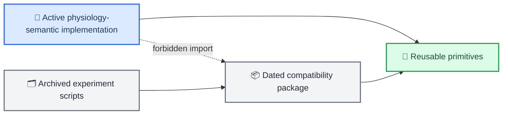

# Source-code authority map

_Active, reusable, and compatibility boundaries as of 2026-07-02_

---

## 📋 Dependency rule

New physiology-semantic code may depend on reusable packages, but it must not import the dated compatibility namespace. Historical tools opt in to compatibility explicitly.

## 🧱 Reusable packages

| Path | Role in the redesign |
| --- | --- |
| `data/` | Dataset registry, loaders, preprocessing, channel adjacency, and Croce cache adapter |
| `inference/` | Neurovascular state-space inference reused by the physical teacher |
| `tokenizers/` | Base interface and candidate single-modality quantizer/encoder primitives |
| `losses/` | Architecture-neutral reconstruction, alignment, and classification losses |
| `metrics/` | Reconstruction and codebook-health metrics |
| `foundation/` | Candidate contextual sequence components; not yet target authority |
| `utils/` | Logging, checkpoint, launch, and I/O infrastructure |
| `visualization/` | Generic tokenizer, classifier, TensorBoard, and gradient utilities |

`src/tokenizers` no longer registers `source_observation_labram_vqnsp` or `factorized_labram_vqnsp` by default.

## 📦 Compatibility package

[`compatibility/pre_physiology_semantic_20260701/`](compatibility/pre_physiology_semantic_20260701/README.md) contains the old source/observation model, coupling losses, cross-modal fusion, ELP prototype, and contract-specific visualizations. It exists for checkpoint interpretation and historical reproduction only.

## 🧪 Implementation placement

New target modules should be introduced in a dedicated active package after their interfaces are fixed in the implementation plan. Do not rename compatibility classes into the active namespace or use archived registry aliases as target config types.

_Last updated: 2026-07-02_
